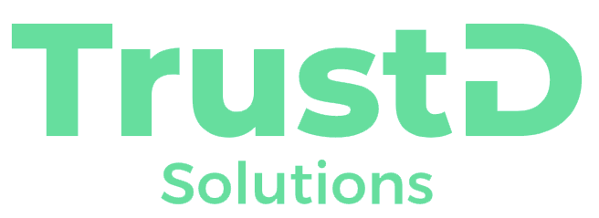

# 

# Business Developement Associate (Remote)

## What we do?
- We are a DevOps Consulting company. Our clients hire us as a permanent outsourced DevOps partner.
- We specialize in working with Kubernetes and cloud-native projects in the major Cloud providers 
and our engineers enjoy wearing many technology hats of a small boutique firm without the corporate headaches.
- If you want to make fast-paced decisions, work in a thriving environment with technologies like EKS/GKE, Terraform, Helm, CI/CD, and learn alongside a group of amazing people... Apply now!

## Duties
- [ ] Use lead generation tools to extract contacts and craft targeted lists of prospects
- [ ] Use tools such as LinkedIn and Google to research prospects
- [ ] Find and identify different triggers for high-value prospects
- [ ] Use the best practices for email, phone, and social media to connect with new prospects
- [ ] Learn sales terminology, organizational structures, and business motivations
- [ ] Ask intelligent, relevant questions to speak knowledgeably with decision-makers at companies
- [ ] Build interest and qualify decision-makers to schedule a meeting with them, ultimately
- [ ] Use technology such as CRM and sales acceleration software to be a modern sales pro

## Requirements
- [ ] Be reliable
- [ ] communicate well
- [ ] Speak English
- [ ] Strong desire to start a career in tech sales

## Salary
- [ ] Above average

## Benefits
- [x] 100% remote, full-time position
- [x] Competitive compensation
- [x] Work with cutting-edge technology - NO legacy systems!
- [x] Career advancement opportunities

# How to apply
Email us at staff@trustd.solutions with the Subject `BBusiness Development Associate` and your contact information in the body(Phone, and Linkedin URL).
