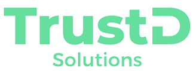

# 

# Site Reliability Engineer (Remote)

## What do we do?
- We are a DevOps Consulting company. Our clients hire us as a permanent outsourced DevOps partner.
- We specialize in working with Kubernetes and cloud-native projects in the major Cloud providers. Our engineers enjoy wearing many technology hats of a small boutique firm without the corporate headaches.

If you want to work in a thriving fast-paced environment with technologies like EKS/GKE, Terraform, Helm, Argo/Flux and learn alongside a group of amazing people, Apply now!

## Responsibilities
- [ ] Above all things, LEARN from our fellow SREs
- [ ] Build and maintain tools for deployment, monitoring, and operations
- [ ] Troubleshoot and resolve issues in client lower and production environments
- [ ] Automate and streamline client operations and processes
- [ ] Automate and maintain software build processes
- [ ] Automate software deployment and monitoring
- [ ] Monitor site stability and performance and troubleshoot issues
- [ ] Scale infrastructure to meet rapidly increasing demand
- [ ] Collaborate with developers to bring new features and services into production
- [ ] Provide support to development teams that use the automated infrastructure
- [ ] Develop and improve operational practices and procedures

## Requirements
- [ ] Solid written English communication skills
- [ ] Will to improve your written & spoken English communication skills
- [ ] Experience in production-ready operations, preferably supporting highly available environments.
- [ ] Experience with designing and maintaining modern application CI/CD pipelines (e.g. Github Actions, GitLab, Jenkins).
- [ ] Hands-on experience with cloud infrastructure environments (AWS, GCP)
- [ ] Hands-on experience with container orchestration tools, especially Kubernetes
- [ ] Hands-on experience with YAML configuration management tools (e.g. Ansible, Helm)
- [ ] Hands-on experience with infra as code tooling (e.g. Terraform) 
- [ ] System debugging experience
- [ ] Knowledge of developing workflow tools
- [ ] Comfortable working in Scrum teams or Kanban

## Compensation
This is a full-time role. Our rate ranges from USD 30 to USD 45/h

## Benefits
- [x] 100% remote, full-time position
- [x] Competitive compensation
- [x] Work with cutting-edge technology - NO legacy systems!
- [x] Online Continuing Education (Cloud Academy)
- [x] Career advancement opportunities

# How to apply
Email us at jobs@trustd.solutions with the Subject `SRE job` and your contact information in the body (Phone, and Linkedin URL).
